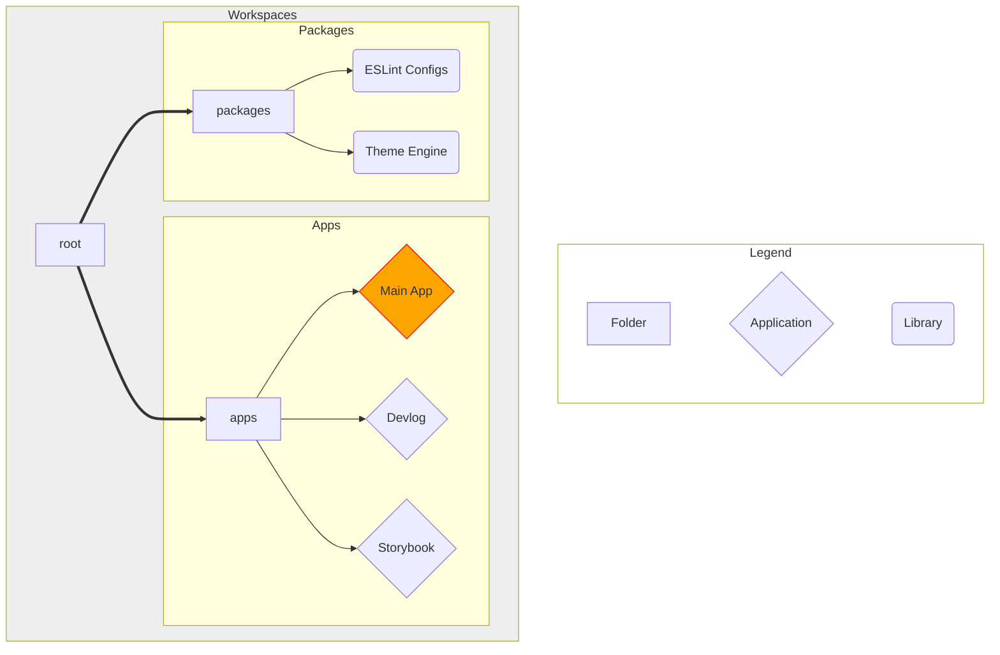

# Overview

First of all, let me reiterate that anything outside the `apps/app` workspace were fun side-projects that I've been itching to attempt, and found themselves in the perfect occasion to do so. There's a [breakdown](#time-breakdown) of the time I spent on each portion of the project, and what is relevant to the project requirements and what isn't. 

:::warning
What was not required for the project is **not** something I would do for a production-ready project.
:::

## Project Structure

Let's let the graph do the talking: 

Okay, I didn't get `mermaid` to make something really, really nice. Essentially, I split the project into apps and libraries. As far as the project is concerned, the `apps/app` is the only bit that matters. The rest is setup, documentation, design system, and other fun distractions (like the theme engine).

## Time Breakdown

---
| Time | Activity | Disclaimer |
| --- | --- | --- |
| 0.6 day | Setup | Setting up turborepo, eslint, testing, and the apps |
| 2 days | Theme Engine | Whooo, boy. Fun, but definitely not needed. Also very cool |