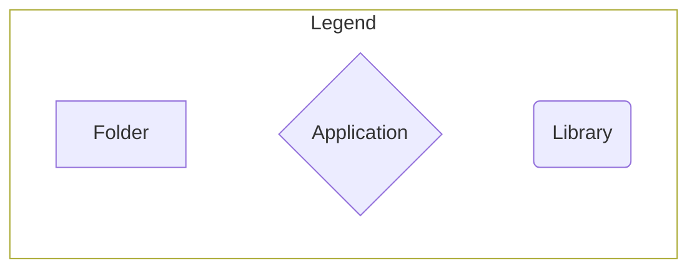
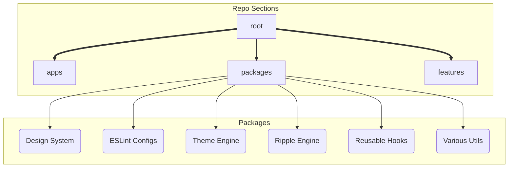
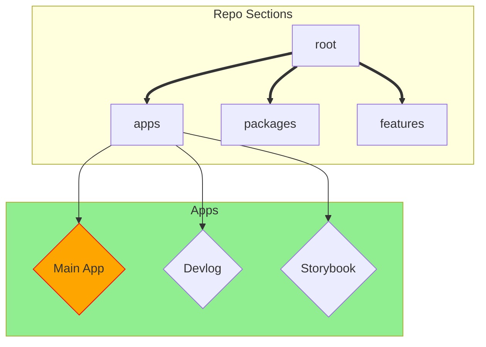
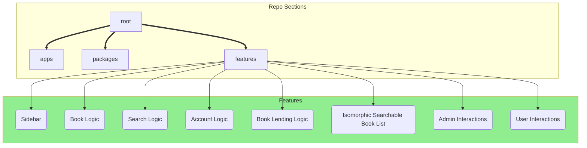

# Overview

First of all, let me reiterate that anything outside the `apps/app` workspace and `features/*` packages was fun side-projects that I've been itching to attempt, and found myself in the perfect occasion to do so. There's a [breakdown](#time-breakdown) of the time I spent on each portion of the project, and what is relevant to the project requirements and what isn't. 

:::warning tl;dr Disclaimer
What was not required for the project is **not** something I would do for a production-ready project.
:::

:::warning 
## Browser warning
This project was built with the latest version of... well, everything but Firefox. They're lagging behind with the `:has` and `@content` (which I planned to use, but didn't get to) selectors.
:::

:::warning Full Disclaimer
I tried multiple approaches to code, multiple **experiments**:
1. Split code into `libs`, `features`, and `apps`, with the main **app** (`apps/app`) combining `features`, and `features` using `libs`. I'm not sure I succeeded completely in this aspect
2. I built a few `libs` from scratch to my liking, as a challenge more than anything else. They're beyond the scope of the requirements and should be treated as libraries downloaded from npm. Could be interesting to look at, and I'm open to feedback on them, but they're not in scope.
3. I tried writing some components (eg. `Book` component) modularly (one component per section, to be assembled by the consumer), while others have been less optimized
4. I wrote some components (eg. `SearchableBookList` component) in an isomorphic fashion (well, not really isomorphic, but it took inspiration: it accepts components to vary the rendering, but does not expose the internals, like the `Book` component)
5. For most components I worked in `Storybook` first, on bare components, and then integrated them into the app (with a few exceptions at the end, which were, by necessity, more tightly coupled, and would make `Storybook` more of a bother)
6. [Optional] In the case of the design system, full Storybook exposure
6. [Optional] In the case of the theme engine full testing: types, unit, and types again. See [this section of the setup](./setup#eslint) for more information.

Also, please check the [future improvements](#future-improvements) section for more information on what I would focus on next.
:::

## Project Structure

Let's let the graph do the talking:







Okay, I didn't get `mermaid` to make something really, really nice. Essentially, I split the project into apps and libraries. As far as the project is concerned, the `apps/app` and all `features/*` packages are the only bits that matter. The rest is setup, documentation, and other fun distractions (like the theme engine).

## "Stolen" Code

Almost all of the code in this project is mine alone. I have taken some code from StackOverflow&trade; (few lines) and I've credited where that was the case. I've also "borrowed" some of the colors, typography, and overall structure of the theme from [Material UI](https://material-ui.com/) as well. 

Finally, there are bits of code that I've taken from older (and public) projects of mine. The theme system is a simplified (and complete) variant of something I've tried to build on an unfinished project, the ripple component was likewise taken from another unfinished project... you'll see a pattern here :sweat_smile:.

## Time Breakdown

---
| Time | Activity | Disclaimer |
| --- | --- | --- |
| 0.6 day | Setup | Setting up turborepo, eslint, testing, and the apps |
| 2 days | Theme Engine | Whooo, boy. Fun, but definitely not needed. Also very cool |
| 1 day | Ripple Engine | I modified an earlier attempt at something like this. |
| 1.5 day | Design System | I assumed this would take quite a while to do right |
| 30 min | Routing Setup | I wanted to try out the object declaration logic of `react-router` |
| 0.5 day | Jotai Based Setup | It was quite an enjoyable experience. It only took so long since it's the first time I tried `jotai` |
| 2 hours | Implementing features into main app | Piecing things together is easy when the hard work is done elsewhere |

## Main Takeaways

:::success
1. Jotai is pretty cool. Would like to get more practice with it, and I would certainly use it less for logic, and more for just storing information, but it's definitely a viable lightweight option for small projects.
2. Setting up a design system, or building a crazy theme engine is loads of fun, tons of work, and none if it unexpected.
3. I can say I quite enjoy working with "features" outside the main project, even though I'm sure I didn't do it properly this time around
4. Note to self: even for side-projects, don't leave too much time for distractions, and focus on the main features first.
:::

I'd like to take a moment to debate point number **4.**, the time balance between raw coding in the beginning (and throughout the latter part of implementation) on things such as *design system* and *theme engine*. On the one hand, I lost quite a bit of time building things from scratch, and building them before I used them. On the other hand, things became a lot simpler later down the line, when it came to implementing the requirements.

### Example 1, the `Flex` component. 

I never thought I'd use something like that, but once I nailed it down (took about 10m at most), I defaulted to using/extending that component instead of writing flex by hand in CSS. Here's whnat it looks like:

```tsx
import { Flex } from '@librario/ui';

const MyComponent = () => (
  <Flex
    direction="column"
    center
    gap={1}
    grow
  />
  <Flex />
  <Flex shrink />
);
```

### Example 2, the `Paper` and `Surface` components. 

Such a joy to use once I built them (took about 30m in total, with tweaking). `Surface` defines elevation (shadows), while `Paper` applies a background color (composing `Surface`). Simple example: 

```tsx
import { Paper } from '@librario/ui';

const MyComponent = () => (
  <Paper>
    <h1>My Paper</h1>
  </Paper>
);
```

### Example 3, the `Typography` component. 

I'll admit, I stole the idea from Material UI, but I did make it my own. It does exactly what you'd expect, render some code to the screen, with multiple variants and colors to choose from. Here's what it looks like:

```tsx
import { Typography } from '@librario/ui';

const MyComponent = () => (
  <Typography variant="h1" color="primary">
    My Title
  </Typography>
  <Typography variant="body1">Some more text</Typography>
);
```

### Example 4, last, but not least, the `Button` and `ButtonGroup` components. 

Same as with `Typography`, define some basic shapes, animate with `Ripple`, and handle `disabled` case, while also having a separate `IconButton` subtype. Here's what it looks like:

```tsx
import { Button, IconButton, ButtonGroup } from '@librario/ui';

const MyComponent = () => (
  <ButtonGroup>
    <Button variant="outlined">Button 1</Button>
    <Button color="primary">Button 2</Button>
    <Button>Button 3</Button>
  </ButtonGroup>
  <IconButton variant="contained">
    <Icon />
  </IconButton>
);
```

:::info 
You can find all of these on the storybook app (link in the header).
:::


## Future Improvements

1. *Mobile support*. I had fully intended to build this in, but I ran out of time. That, and my little blunder with the theme engine, hoping that I can use `css variables` in `@media queries`.
2. *Internationalization*. I'd use some react library (like `react-intl`) with some extractor (`formatjs`) to generate the translation files and implement it directly. 
3. *Better testing*. I'd like to use `react-testing-library` and `jest` to test the components, and `cypress` to test the apps. I'd also use `storybook` stories in the actual tests as well.
4. *Accessibility*. I'd definitely put focus on accessibility. I've done the bare minimum with the `Input`, but there's definitely way more to be done.
5. *Better documentation*. I'd use `typedoc` (preferably integrated with `docusaurus`), and write JS/TSDoc comments. I'd be able to generate a nice API reference and have a nice place to document the components.
6. *Use headless components*. I feel this is definitely the way to go when implementing components from scratch nowadays: grab components with the logic, accessibility, etc. already built in, and then just style them. 

## Biggest Regret {#biggest-regret}

I will not talk about time management, as that should be fairly obvious from the commits, and overall function of quality over time that there is some improvement, and I believe I've already covered why I took so long on tangents (it was for fun, in my spare time).

I will however talk about my one case of serious lack of foresight. 

I'm referring to the clash between the [Searchable Book List](./features/searchableList) and the [Lend Logic](./features/logic/lend) (specifically when rendering the [Books Lent List](./features/interactions/user)). Without going into details, the end result was that the system can **`allow a user to only reserve a copy of a book`** at a time. That felt like a reasonable assumption to make at the very beginning, and by the time I realized the issue, I did not have enough time to revamp everything.

:::warning Conclusion
In conclusion, my biggest regret is the implementation of the [Searchable Book List](./features/searchableList). I wanted to experiment with a few ways of exposing interfaces with React, and this was, by far, the worst. **Lesson learned!**
:::