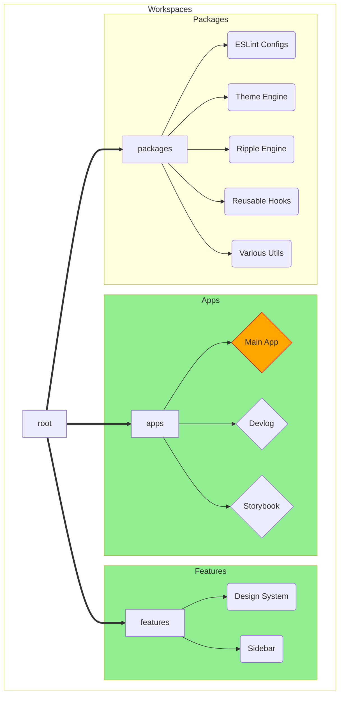
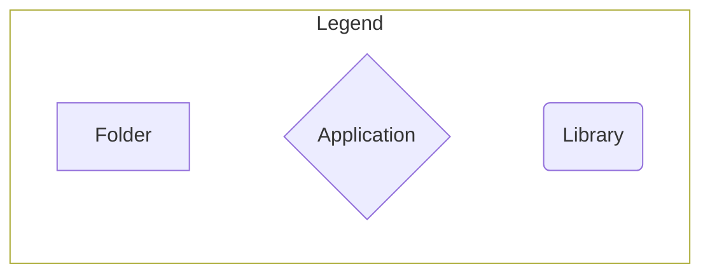

# Overview

First of all, let me reiterate that anything outside the `apps/app` workspace and `features/*` packages was fun side-projects that I've been itching to attempt, and found myself in the perfect occasion to do so. There's a [breakdown](#time-breakdown) of the time I spent on each portion of the project, and what is relevant to the project requirements and what isn't. 

:::warning
What was not required for the project is **not** something I would do for a production-ready project.
:::

## Project Structure

Let's let the graph do the talking: 

  Okay, I didn't get `mermaid` to make something really, really nice. Essentially, I split the project into apps and libraries. As far as the project is concerned, the `apps/app` and all `features/*` packages are the only bits that matter. The rest is setup, documentation, and other fun distractions (like the theme engine).

## "Stolen" Code

Almost all of the code in this project is mine alone. I have taken some code from StackOverflow&trade; (few lines) and I've credited where that was the case. I've also "borrowed" some of the colors, typography, and overall structure of the theme from [Material UI](https://material-ui.com/) as well. 

Finally, there are bits of code that I've taken from older (and public) projects of mine. The theme system is a simplified (and complete) variant of something I've tried to build on an unfinished project, the ripple component was likewise taken from another unfinished project... you'll see a pattern here :sweat_smile:.

## Time Breakdown

---
| Time | Activity | Disclaimer |
| --- | --- | --- |
| 0.6 day | Setup | Setting up turborepo, eslint, testing, and the apps |
| 2 days | Theme Engine | Whooo, boy. Fun, but definitely not needed. Also very cool |