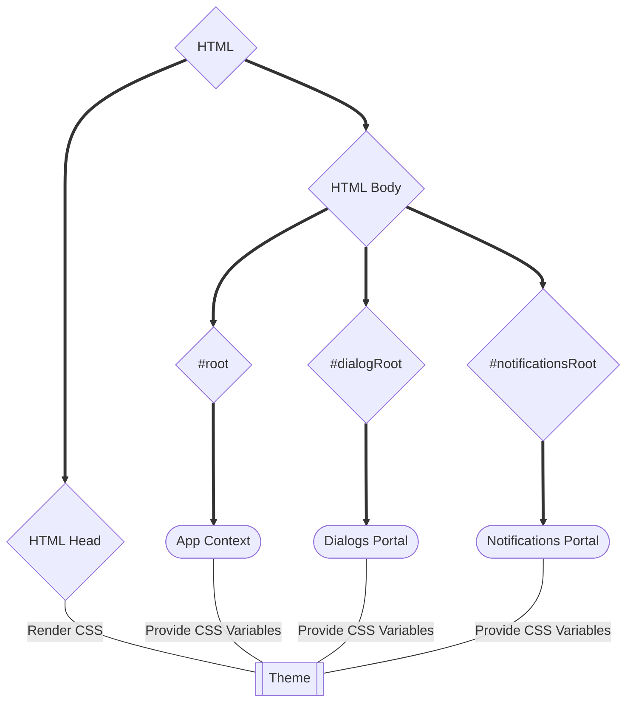

# Theme System

Let's talk about theme systems. Why did I make one from scratch?

## Justification

I started with the following requirements: 
- I will be using some `CSS-In-JS` library, and I want to be able to easily access theme props from within my "CSS"
- I must start with the premise of multi-root support. In essence, any micro-services, or **most importantly**, any React portals (notifications, dialogs, alerts, etc) rendered outside the main application context.
- I want at least a dark/light mode switch, if not multiple themes, and these should be changed globally.

Combined, they present an issue: anything I render outside the main app context will need its own theme providers, and (for example, in the case of `MUI`) will result in `N+1` `<style>` tags being rendered in the DOM (`N` things rendered outside the app context + the app context itself).

Creating a new theme provider for the theme engine may or may not be required, depending on the implementation (lazy way: yes), but I can get around the `N+1` `<style>` tags by relying on `CSS Variables` rendered to the entire page, and the theme engine receiving the variables themselves.

So, something like this graph:

## Theme Requirements

I'd need a way to create two different themes, with different color palettes. At the bare minimum, I want to be able to generate a few colors with variations, for example: 

- `primary` color
- `accent` color
- status colors (`error`, `success`, etc)
- `text` color
- `background` color

And each of these should, at the very least, have a few variations: 

- `main` color
- `light` color
- `dark` color
- `contrastText` color

At least, that's the case for `primary` and `accent`, and not background. Background should have something like:
 
- `paper` color
- `default` color

And then, I'd like to be able to generate my `text` colors based on the `background` color.

Besides these, I'd like some `spacings` to be consistent with my `paddings` and `margins`, `typography` to be consistent with my `fontSizes`, and `breakpoints` to be consistent with my `media queries`.

Also, for the `breakpoints`, it would be nice to have some extra CSS variables to help with that.

Last but not least, some `elevation` shadows, to be consistent with my `box-shadows`, and some functionality for transitions.

:::warning Before I forget
All of these should be nicely typed, so I know what I'm rendering to the CSS when I use a variable from the theme
:::

## Implementation

Let's be honest, this app is a **POC**, not production-ready. 

Generating colors is nice, and I can create a generator for each color palette, join them nicely, and export them as both the CSS rules that need to be rendered in the head (see the chart above). Also, I won't be generating the `text` color based on `background`. It would be awesome, but that's... not really the point, here.

Same with breakpoints. No need to complicate this one, though, I can process the breakpoints I set, and create a few functions to generate the media queries for me, instead.

The function for transitions is... well, just that, a function.

Everything else can be processed as-is (transform values and mixins from statically defined props into CSS variables).

## Coding Approach

As tempting as it may be to use `console.log` iteratively or something like `Quokka` to run things directly, I went through all the trouble in the [setup section](./setup) to set up both unit and type testing. I'm going to make the best of it.

1. I'll start by writing up some helpful types first, on the more complex types, and test them.

2. Then, I'll move on to some util functions, and test both their types and functionality.

3. After that, I'll move on to the core of the theme generation, and the outputs it'll have, and do the same as the utils.

4. Finally, I'll move on to the React part of the system, and... well, I'll skip the tests here, React helps a bunch, but I will still unit test them, and write some stories. 